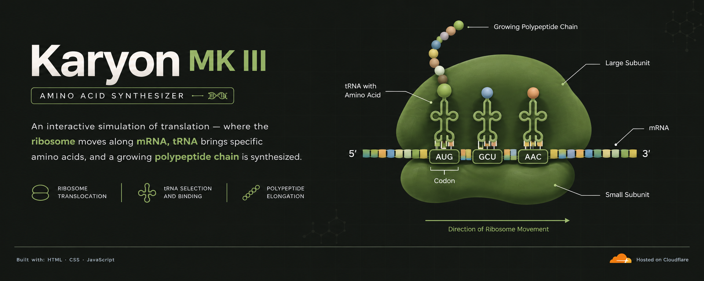

  

# 🧬 Karyon MK III

### *Interactive Amino Acid Synthesizer*

> An interactive HTML simulator demonstrating protein translation through ribosome movement, mRNA decoding, tRNA recognition, and polypeptide chain synthesis.

**🧬 Protein Translation · 🧪 Codon Recognition · 🧫 Polypeptide Synthesis**

---

## ✦ Features

**🧬 Ribosome Translocation**  
Visualize ribosome movement along the mRNA strand.

**🧪 Codon–Anticodon Recognition**  
Explore complementary pairing between mRNA codons and tRNA anticodons.

**🔬 tRNA Selection**  
Observe tRNA recognition and amino acid delivery during translation.

**🧬 Polypeptide Chain Elongation**  
Visualize the progressive formation of the growing polypeptide chain.

**🎮 Interactive Translation Controls**  
Control and observe the progression of protein synthesis.

---

## 🧬 Core Concepts

**mRNA · Codons · Anticodons · tRNA · Ribosome · Translation · Polypeptide Elongation**

---

## ⚙️ Technology

**HTML · CSS · JavaScript**

---

## 📜 License

**GNU General Public License v3.0 (GPL-3.0)**
